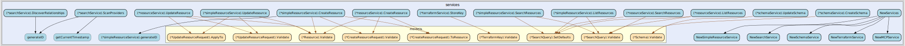
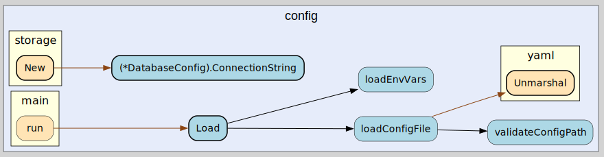

# Siros Backend Call Graph Documentation

## Overview

This document provides a comprehensive analysis of the Siros backend call graph, illustrating how different components interact and the flow of execution through the system. The visualizations help understand the architecture, dependencies, and execution paths within the multi-cloud resource management platform.

## Architecture Overview

Siros follows a **clean architecture** pattern with clear separation of concerns across multiple layers:

### Layer Structure

1. **Entry Point**: `main.go` - Application bootstrap and configuration loading
2. **API Layer**: HTTP server setup, routing, and middleware management
3. **Controller Layer**: HTTP request handling and response formatting
4. **Service Layer**: Business logic orchestration and validation
5. **Repository Layer**: Data access abstraction (planned)
6. **Storage Layer**: PostgreSQL/pgvector integration
7. **Provider Layer**: Multi-cloud integrations (AWS, Azure, GCP, OCI)

### Key Design Principles

- **Dependency Injection**: Components receive dependencies through constructors
- **Interface Segregation**: Each layer depends on interfaces, not concrete implementations
- **Single Responsibility**: Each component has a focused, well-defined purpose
- **Layered Architecture**: Clear boundaries with unidirectional dependencies

## Call Graph Visualizations

### Primary Visualization

#### Comprehensive Call Graph (Enhanced Depth)

The complete call graph with enhanced depth parameters showing all components, dependencies, and execution flows:


**Key Features:**

- **Enhanced Depth**: Shows deeper function call relationships and internal interactions
- **Complete Dependencies**: Includes both Siros-specific code and external dependencies
- **Optimal Layout**: Configured with enhanced grouping (`pkg,type`) and spacing parameters
- **Database Integration**: Visualizes PostgreSQL connections, context handling, and storage interactions
- **Service Layer Detail**: Shows detailed service orchestration and business logic flows

This visualization provides the most comprehensive view of the Siros backend architecture, making it the primary reference for understanding system interactions.

### Component-Specific Views

The following visualizations focus on specific architectural layers and provide detailed views of individual components:

### 1. API Layer Architecture

The API layer manages HTTP routing, middleware, and request/response handling:


**Key Components:**

- **Server**: Central HTTP server with embedded asset serving
- **Router**: Gorilla Mux-based routing with middleware integration
- **Middleware**: CORS, authentication, logging, and request ID handling
- **Route Setup**: Organized endpoint configuration

**Request Flow:**

1. HTTP request received by server
2. Middleware chain processes request (CORS, auth, logging)
3. Router dispatches to appropriate controller
4. Response formatted and returned through middleware chain

### 2. Services Layer

The service layer handles business logic orchestration and coordination between components:



**Service Responsibilities:**

- **Resource Service**: CRUD operations and business logic for cloud resources
- **Search Service**: Semantic search using vector embeddings and similarity queries
- **Schema Service**: Custom schema management and validation
- **Terraform Service**: Terraform state import and resource mapping
- **MCP Service**: Model Context Protocol API integration
- **Audit Service**: Blockchain-based audit trail management
- **Health Service**: System health monitoring and readiness checks

**Service Layer Benefits:**

- Business logic separation from HTTP concerns
- Reusable components across different API interfaces
- Transaction boundary management
- Cross-cutting concerns (logging, metrics, validation)

### 3. Storage and Configuration

Storage and configuration management provide data persistence and system setup:


**Configuration Features:**

- YAML-based configuration files
- Environment variable overrides
- Validation and default value handling
- Runtime configuration management

**Storage Architecture:**

- PostgreSQL with pgvector extension for vector similarity search
- Vector embedding storage and retrieval
- Connection pooling and transaction management
- Database initialization and schema management

### 4. Configuration Layer

Configuration management provides centralized system setup and runtime parameters:



**Configuration Components:**

- **Config Loading**: YAML file parsing with validation
- **Environment Variables**: Override support for deployment flexibility
- **Default Values**: Fallback configuration for missing parameters
- **Type Safety**: Structured configuration with Go type validation

**Configuration Flow:**

1. Load configuration from YAML files
2. Apply environment variable overrides
3. Validate configuration structure and values
4. Provide configuration to application components

### 5. Middleware Stack

The middleware stack provides cross-cutting concerns for all HTTP requests:


**Middleware Components:**

- **CORS Middleware**: Cross-origin request handling for frontend integration
- **Authentication Middleware**: JWT token validation and user context injection
- **Logging Middleware**: Request/response logging with correlation IDs
- **Request ID Middleware**: Unique request tracking for debugging and tracing
- **Error Handling**: Consistent error response formatting and logging

**Middleware Flow:**

1. CORS validation for cross-origin requests
2. Authentication and authorization checks
3. Request ID generation and context injection
4. Request logging and metrics collection
5. Route to appropriate controller
6. Response formatting and logging

## Execution Flow Patterns

The comprehensive call graph reveals several key execution patterns within the Siros backend:

### 1. Application Bootstrap Flow

**Visible in comprehensive graph:**

```text
main → run → config.Load → connectDB → storage.New → api.NewServer → startServer
```

**Key Components:**

- **Configuration Loading**: YAML parsing with environment overrides
- **Database Connection**: PostgreSQL with pgvector extension initialization
- **Storage Layer**: Vector-capable storage system setup
- **API Server**: HTTP server with embedded frontend assets
- **Graceful Startup**: Proper error handling and resource management

### 2. Request Processing Flow

**HTTP Request Pipeline:**

```text
HTTP Request → CORS → Auth → Logging → Router → Controller
                ↓
Service Layer → Validation → Storage Layer → PostgreSQL/pgvector
                ↓
Vector Operations → Blockchain Audit → Response Formatting → Client
```

### 3. Resource Management Flow

**Resource Operations:**

```text
Resource Request → Resource Controller → Resource Service
                ↓
Data Validation → Vector Generation → Storage Persistence
                ↓
Audit Trail Creation → Relationship Discovery → Response
```

### 4. Search and Discovery Flow

**Semantic Search Operations:**

```text
Search Request → Search Controller → Search Service
                ↓
Vector Similarity Query → PostgreSQL/pgvector → Result Ranking
                ↓
Response Formatting → Client
```

**Cloud Discovery Process:**

```text
Discovery Trigger → Provider Manager → Cloud Provider APIs
                ↓
Resource Enumeration → Data Normalization → Vector Generation
                ↓
Storage Persistence → Audit Trail → Discovery Complete
```

## Key Architectural Decisions

### 1. Embedded Assets

- Frontend React application embedded in Go binary using `embed.FS`
- Single binary deployment with no external dependencies
- Development fallback serves placeholder page when assets unavailable

### 2. Vector-First Architecture

- Every resource stored as individual vector with metadata
- Semantic search capabilities using pgvector
- Relationship discovery through vector similarity
- Hierarchical organization maintained through queries

### 3. Multi-Protocol Support

- **HTTP API**: RESTful endpoints for standard operations
- **Terraform Provider**: Native Terraform integration for IaC workflows
- **MCP Protocol**: Model Context Protocol for AI/LLM integration

### 4. Blockchain Audit Trail

- Immutable change tracking for compliance
- Cryptographic verification of all modifications
- Complete resource lifecycle visibility
- Actor attribution and temporal ordering

## Performance Considerations

### 1. Database Optimization

- Connection pooling for concurrent requests
- Prepared statements for SQL injection prevention
- Vector indexing for fast similarity queries
- Read replicas for high-traffic scenarios (planned)

### 2. Concurrency

- Goroutine-based request handling
- Context propagation for cancellation
- Race condition prevention through proper locking
- Background processing for long-running operations

### 3. Memory Management

- Streaming for large dataset processing
- Proper resource cleanup and garbage collection
- Vector memory optimization techniques
- Caching strategies for frequently accessed data

## Security Architecture

### 1. Authentication Flow

```text
JWT Token → Middleware Validation → Context Injection → Controller Access
           ↓
User Permissions → Service Authorization → Resource Access Control
```

### 2. Input Validation

- Controller-level input sanitization
- SQL injection prevention through parameterized queries
- XSS protection in response formatting
- CORS policy enforcement

### 3. Audit and Compliance

- Blockchain-based change tracking
- Complete request/response logging
- User action attribution
- Compliance reporting capabilities

## Development Workflow

### 1. Adding New Controllers

1. Create controller in `internal/controllers/`
2. Implement handler methods following APIResponse pattern
3. Add routes in `internal/api/routes/`
4. Register controller in `controllers.go`
5. Update tests and documentation

### 2. Adding New Services

1. Define service interface in `internal/services/`
2. Implement business logic methods
3. Add repository dependencies
4. Register in service container
5. Update controller integration

### 3. Adding New Providers

1. Implement CloudProvider interface
2. Add provider-specific client initialization
3. Implement resource discovery and management
4. Add to provider manager
5. Update configuration options

## Monitoring and Observability

### 1. Logging Strategy

- Structured logging with correlation IDs
- Different log levels (DEBUG, INFO, WARN, ERROR)
- Request/response tracing
- Performance metrics collection

### 2. Health Checks

- Database connectivity validation
- Provider authentication verification
- System resource monitoring
- Dependency health assessment

### 3. Metrics Collection

- HTTP request metrics (latency, throughput, errors)
- Database query performance
- Vector search performance
- Provider API response times

## Regenerating Call Graphs

To regenerate the call graph visualizations:

### Using Scripts

```powershell
# Windows PowerShell
.\scripts\generate-callgraph.ps1 -VerboseOutput

# Generates:
# - full-comprehensive.svg (primary overview)
# - api-layer.svg (API components)
# - services-layer.svg (business logic)
# - storage-layer.svg (data persistence)
# - config-layer.svg (configuration)
# - middleware.svg (cross-cutting concerns)
```

### Manual Generation

```bash
# Navigate to backend directory
cd backend

# Generate comprehensive overview
go-callvis -rankdir=LR -minlen=1 -nodesep=0.3 -group=pkg,type -file=../docs/callgraph/full-comprehensive github.com/LederWorks/siros/backend/cmd/siros-server

# Generate component-specific views
go-callvis -focus=github.com/LederWorks/siros/backend/internal/api -nostd -file=../docs/callgraph/api-layer github.com/LederWorks/siros/backend/cmd/siros-server
```

### VS Code Integration

Use the VS Code tasks for convenient generation:

- **Ctrl+Shift+P** → "Tasks: Run Task" → "Generate Call Graphs"
- View generated graphs directly in VS Code markdown preview
- Automatic documentation updates with embedded SVG references

### Generated Files

The script creates the following files in `docs/callgraph/`:

| File | Purpose | Size |
|------|---------|------|
| `full-comprehensive.svg` | Complete architecture overview | ~53KB |
| `api-layer.svg` | API and routing components | ~24KB |
| `services-layer.svg` | Business logic layer | ~61KB |
| `storage-layer.svg` | Data persistence components | ~13KB |
| `config-layer.svg` | Configuration management | ~9KB |
| `middleware.svg` | Cross-cutting concerns | ~21KB |

## Future Enhancements

### 1. Provider Layer Integration

- Complete multi-cloud provider implementation (AWS, Azure, GCP, OCI)
- Unified interface for cloud resource management
- Cross-cloud relationship discovery and mapping
- Provider-specific authentication and credential management

### 2. Repository Layer Implementation

- Complete data access abstraction layer
- Multiple storage backend support
- Advanced caching layer integration
- Transaction boundary management and optimization

### 3. Enhanced Monitoring and Observability

- Distributed tracing with OpenTelemetry integration
- Prometheus metrics export and collection
- Grafana dashboard integration for visualization
- Real-time performance monitoring and alerting

### 3. Advanced Features

- Resource relationship auto-discovery
- Predictive analytics for capacity planning
- Policy-based compliance checking
- Cost optimization recommendations

---

## Last Updated

This documentation is automatically updated when call graphs are regenerated.
